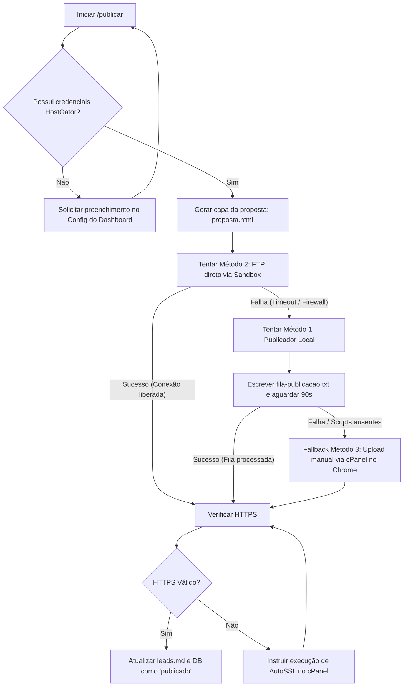

# public.md: Mapeamento do Sistema de Publicação Atual

Este documento detalha o funcionamento, fluxos, scripts e métodos de fallback que o plugin **Prospector de Sites** utiliza na versão atual (v2.1.0) para publicar e disponibilizar online as demonstrações e páginas redesenhadas dos leads na hospedagem **HostGator**.

---

## 1. Visão Geral do Fluxo de Publicação

O comando `/publicar [cliente|todos]` executa o seguinte processo sequencial:



---

## 2. Configuração de Credenciais

As credenciais necessárias para qualquer método de publicação residem localmente no arquivo `prospector-config.json` dentro do bloco `hostgator`:

```json
"hostgator": {
  "usuario": "usuario_cpanel",
  "dominio": "meudominio.com.br",
  "servidor": "br123.hostgator.com.br",
  "senha": "senha_criptografada_ou_texto",
  "pastaBase": "clientes"
}
```

* **Segurança:** A senha vive unicamente neste arquivo local. Ela nunca deve ser impressa no chat ou em arquivos de log que o usuário veja.
* **Destino do Deploy:** O caminho padrão no servidor é `public_html/[pastaBase]/[slug]/index.html` e a capa correspondente fica em `public_html/[pastaBase]/[slug]/proposta.html`. A URL pública de visualização gerada será `https://[dominio]/[pastaBase]/[slug]/`.

---

## 3. Detalhamento dos Métodos de Deploy

O sistema implementa uma hierarquia de três métodos de deploy para garantir a publicação mesmo sob severas restrições de rede:

### Método 1: Publicador Automático Local (Método Principal)
Dado que a rede do sandbox do Cowork não alcança servidores externos via FTP (devido a firewalls/diretivas do ambiente do agente), o sistema instala scripts locais que rodam na máquina do usuário.

1. **Scripts Utilizados (Copiados no `/setup` para a raiz da pasta conectada):**
   * **Windows:**
     * `instalar-publicador.bat`: Registra a tarefa agendada `"ProspectorPublicador"` no Agendador de Tarefas do Windows para executar a cada 1 minuto.
     * `publicador-oculto.vbs`: Script VBScript que chama o batch de upload de forma silenciosa (escondendo a janela do Prompt de Comando).
     * `publicar-agora.bat`: Executa o PowerShell `publicar-agora.ps1`.
     * `publicar-agora.ps1`: Script PowerShell principal. Ele verifica se o arquivo `fila-publicacao.txt` existe. Se existir:
       * Lê o `prospector-config.json`.
       * Carrega cada linha da fila (formato: `caminho_local|caminho_remoto`).
       * Realiza o upload FTP usando a classe `.NET [System.Net.FtpWebRequest]`.
       * Registra os eventos em `publicador-log.txt`.
       * Após concluir todos os uploads, renomeia o arquivo de fila para `fila-publicada-[data_hora].txt`.
   * **macOS:**
     * `instalar-publicador.command`: Registra um Launch Agent (`com.prospector.publicador.plist`) no macOS `launchd` para rodar a cada 60 segundos.
     * `publicar-agora.command`: Script bash que executa uploads baseados na fila usando o comando `curl` local.

2. **Funcionamento da Fila (`fila-publicacao.txt`):**
   O plugin no sandbox apenas cria o arquivo `fila-publicacao.txt` na raiz da pasta do usuário com o seguinte conteúdo:
   ```text
   sites/slug-cliente/index.html|public_html/clientes/slug-cliente/index.html
   sites/slug-cliente/proposta.html|public_html/clientes/slug-cliente/proposta.html
   ```
   A tarefa local detecta o arquivo em até 60 segundos, executa os uploads por FTP na HostGator e arquiva a fila.

---

### Método 2: FTP Direto via Sandbox (Tentativa Silenciosa)
Antes de acionar a fila local, o plugin tenta realizar o deploy diretamente a partir do seu próprio container/sandbox.

* **Execução:** O plugin executa o comando `curl` silenciosamente:
  ```bash
  curl -sS --connect-timeout 15 -T "sites/[slug]/index.html" "ftp://[servidor]/public_html/[pastaBase]/[slug]/index.html" --user "[usuario]:[senha]" --ftp-create-dirs
  ```
* **Comportamento:** Se o sandbox tiver conectividade de saída liberada na porta 21 (FTP), o deploy ocorre instantaneamente sem nenhuma ação do usuário. Se falhar por *timeout* ou conexão recusada, o plugin passa para o **Método 1** sem exibir erros alarmantes.

---

### Método 3: Upload via Navegador (Último Recurso)
Se os métodos anteriores falharem ou o usuário não tiver o publicador local instalado/configurado (por exemplo, falha em dependência ou falta do Python/Powershell correto):

* **Execução:** O plugin guia o usuário através da extensão do Chrome integrada (Claude in Chrome):
  1. Solicita ao usuário para abrir o cPanel da HostGator e logar.
  2. O plugin navega até o **File Manager**.
  3. Acessa a pasta `public_html/[pastaBase]/`.
  4. Cria a pasta com o `[slug]` do cliente.
  5. Realiza o upload manual arrastando/selecionando as páginas `index.html` e `proposta.html`.

---

## 4. Etapa Crítica: Validação HTTPS
Nenhuma publicação é considerada concluída se a URL final não puder ser acessada via HTTPS de forma segura.

1. **Validação:** Após o deploy, o plugin testa a URL `https://[dominio]/[pastaBase]/[slug]/`.
2. **Erro de Certificado:** Caso a URL apresente erro de SSL/HTTPS, o deploy fica travado. O plugin instrui o usuário a realizar as seguintes ações:
   * Acessar o cPanel da HostGator.
   * Entrar em **SSL/TLS Status**.
   * Selecionar o domínio correspondente e clicar em **Run AutoSSL** (pode levar alguns minutos).
   * O plugin só marca o status do lead como `publicado` e libera o link para o e-mail de proposta após o carregamento seguro (cadeado verde/válido).

---
